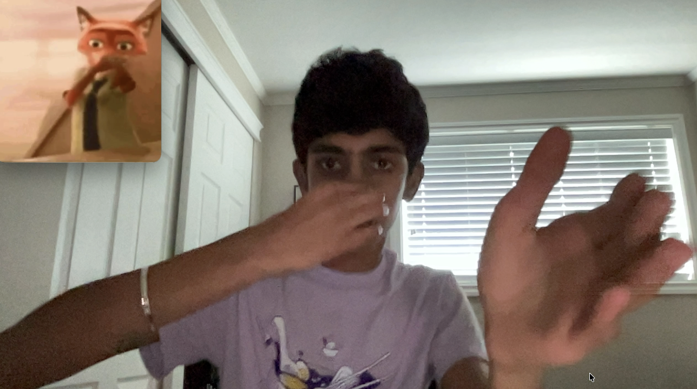

# Scuba Meme Detector

[](https://www.python.org/downloads/)
[](https://opensource.org/licenses/MIT)
[](https://github.com/Tarun5v/scuba-meme-detector/stargazers)
[](https://developers.google.com/mediapipe)

A local, open-source Python app that watches your webcam in real time, tracks
your body with computer-vision pose landmarks, and plays the viral **Scuba
Dance** meme video the instant you strike the pose.

**No cloud. No accounts. No uploads.** Everything runs on your machine. Open
your camera, raise your hands around your face and touch your nose, and the meme
fires at you — then stops itself the moment you drop the pose.

## Demo



Strike the Scuba pose (both hands up, one fingertip on the nose) and the meme
plays. Drop the pose and it stops automatically. The normal window is just your
clean webcam feed, so it feels like a magic camera.

---

## Why I Built This

I've always loved the kind of app that turns your own living room into an
interactive toy. The Scuba Dance — raising both hands around your face and
bringing a fingertip to your nose while you bob — is inherently playful, and
calling it is a fun excuse to wrestle with **real-time computer vision**.

Too often, "detect a movement" demos are either a black box (send frames to a
cloud API) or a toy that only works under perfect lighting. I wanted something
that runs **fully offline**, fires reliably on a real, natural dance, ignores
the hundreds of normal things you do with your hands every minute, and feels
responsive the way a party trick should. This project is that experiment.

## Where I Got the Idea

The move comes from the viral **Scuba Dance / "Signature Scooba"** trend —
people pinch their nose like they're diving underwater and bob around. I wanted
that moment, caught live by a webcam, to trigger the meme reaction video. Most
projects treat "pose detection" as a solved, magic call; I wanted to understand
what a detector is *actually* deciding per frame and hand-tune it against real
footage.

Key references that shaped the approach:

- [MediaPipe Pose](https://developers.google.com/mediapipe/solutions/vision/pose_landmarker) — the 33-landmark skeleton this uses.
- [Know Your Meme](https://knowyourmeme.com/) — research on the Scuba/Scooba dance and its defining gestures.

## Why The Detection Is Hard

"Raising a hand to your face" sounds trivial, but a camera sees only bare
`(x, y)` coordinates of joints. The challenges that shaped this project:

1. **Your hands are always near your face.** Scratching, resting a chin,
   adjusting glasses — a naive "hand close to nose" rule false-fires constantly.
2. **The dance is subtle.** Real recordings showed people keep their hands
   *compact* up around the face, not waving wildly like a swimmer. A detector
   demanding big motion would almost never fire.
3. **Every person has different proportions and sits at different distances.**
   Thresholds must be relative to the person's own body, not fixed pixels.
4. **It must be responsive but not twitchy.** Trigger too easily and resting
   your hand there sets it off; too slowly and the fun is gone.

## What I Learned

Building this detector taught me more than any tutorial:

- **The "wave" assumption was wrong.** I originally required a wide back-and-forth
  wave. Real recordings proved people dance with compact hands near the face, so
  I rebuilt the detector around *raised hands + nose contact* instead.
- **Measure the right joint.** The wrist almost never reaches the nose; the
  fingertips do. Tracking the wrong landmark made detection unreliable.
- **Jitter is the enemy.** Landmark coordinates wobble a few percent every frame.
  You can't trust a single frame — you have to accumulate evidence over a window.
- **Normalize to the body, not the pixels.** Scaling distances by shoulder width
  makes thresholds work at any camera distance and body size.
- **Big motion ≠ the gesture.** The most distinctive part of this dance is a
  *held posture* — both arms up with a hand on the nose — not speed or amplitude.

---

## Results

The detector was tuned against a real 120-frame webcam recording of the dance
and a set of "non-dance" captures. This table summarizes how it performs on that
reference data:

| Condition                       | Did it trigger? |
| ------------------------------- | --------------- |
| Real dance (120-frame recording) | **Yes — 100%**  |
| One-handed face touch            | No              |
| Both arms up, no nose contact    | No              |
| Single hand waving, no nose      | No              |
| Hands on hips                    | No              |
| Arms down (idle)                 | No              |

The magic number: the pose must be *held* (score above threshold for a few
consecutive frames), so it ignores the tiny motions you make constantly and only
fires when you're deliberately doing the dance.

---

## Features

- **Real-time body tracking** at 30+ FPS on a 720p mirrored (selfie) webcam feed.
- **Heuristic pose scoring** that recognizes the Scuba signature: **both arms up
  + a fingertip reaching the nose**, held over a short window.
- **Accurate discrimination** — a one-handed face touch, both arms raised with no
  nose contact, arms down, or hands on hips are all ignored.
- **Debounced triggering** so a brief flinch doesn't fire the move.
- **Clean camera view** — the normal feed shows just your camera, no text or
  skeleton overlays, while detection runs silently in the background.
- **Smart meme playback** that auto-stops the moment you drop the pose, and
  returns you to your live feed.
- **A merged debugger** mode to visualize what the detector sees (skeleton, key
  points, all raw signals) and capture photos or videos — great for tuning.
- **Fully local** — MediaPipe pose landmarks run on your CPU, no network calls.

---

## Requirements

- **Python 3.10+**
- A working **webcam**
- [`pip`](https://pip.pypa.io/en/stable/) to install dependencies

## Setup

1. **Clone the repo:**

   ```bash
   git clone https://github.com/Tarun5v/scuba-meme-detector.git
   cd scuba-meme-detector
   ```

2. **(Recommended) Create a virtual environment:**

   ```bash
   python3 -m venv .venv
   source .venv/bin/activate        # Windows: .venv\Scripts\activate
   ```

3. **Install dependencies:**

   ```bash
   pip install -r requirements.txt
   ```

   This installs `opencv-python` (webcam + video playback), `mediapipe`
   (pose landmark tracking), and `numpy`.

4. **Add your meme video:**

   Drop a clip of the Scuba Dance meme into the `assets/` folder. The app plays
   whichever it finds first:

   - `assets/nick_wilde_scuba.mp4` — the clip bundled with this project
   - `assets/scuba_meme.mp4` — a general fallback name for your own clip

   Any `.mp4` of the trend works. A short 3–10 second clip loops best. See
   `assets/README.md` for details.

   > Video files are deliberately excluded from version control (they're large
   > and often copyrighted), so this step is always yours.

---

## How to Run

On macOS / Linux you can launch everything with the included script:

```bash
./run.sh
```

Or run the app directly with your Python environment:

```bash
python3 src/main.py
```

A window titled **Camera (q to quit)** opens showing your mirrored feed — clean,
no overlays. Then just do the move:

1. Raise both hands up around your face.
2. Bring one hand's fingertips to your nose.
3. Bob / sway naturally.

Hold it for a fraction of a second and the meme video plays. When you drop the
pose (or the clip ends / you skip it), you're straight back in your live feed.

### Controls

| Key          | Action                                 |
| ------------ | -------------------------------------- |
| `Q` / `ESC`  | Quit the app                           |
| `Space`      | Skip the meme video while it's playing |
| Stop dancing | Auto-stops the meme video              |

---

## For Developers

### The merged debugger

Want to see what the detector is actually looking at? There's a built-in
**CV debugger** that overlays the skeleton, coloured key landmarks, and every
raw signal that feeds the score — so you can tune it or just marvel at the
computer vision.

```bash
# from the project root (developer tool, local-only)
.venv/bin/python tools/debugger.py
```

| Key      | Action                                               |
| -------- | ---------------------------------------------------- |
| `Space`  | Save a photo snapshot (PNG + JSON breakdown)         |
| `S`      | Start / stop recording a video of the overlay        |
| `Q`/`ESC`| Quit                                                 |

Photos and videos land in `debug_shots/`. This tool is local-only and not part
of the packaged app.

### How The Pose Detection Works

Under the hood this is straightforward **landmark geometry** — no cloud, no
magic. MediaPipe Pose returns 33 body landmarks per frame.
`src/detector.py` scores how strongly the frame matches the Scuba Dance, which
is really a **face + hand** move:

1. **Both hands raised** — both wrists must be lifted up near the shoulders.
   This is the defining posture: it separates the dance from casually touching
   your face with one hand.
2. **Fingertip on the nose** — at least one index/middle fingertip reaches the
   nose. We measure from the **fingertips**, not the wrist, because the
   fingertips are what actually reach the nose. Held over a rolling window so a
   shaky pinch still registers.
3. **Small motion bonus** — the free hand swaying a little adds to the score,
   but a compact, fairly-still dance still counts.

Because the dance is repetitive, the detector **accumulates evidence over a
short rolling window** instead of demanding every condition fire on the exact
same frame. All distances are normalized by **shoulder width**, so they work at
any camera distance and body size.

`src/main.py` requires the score to stay high for `HOLD_FRAMES` consecutive
frames (debounce) before triggering, then enforces a short cooldown so it
doesn't spam the meme. While the video plays it keeps scoring the webcam every
frame and automatically stops once you stop dancing (after a short grace
period).

All thresholds live at the top of each file and are easy to tune.

### Project Layout

```
scuba-meme-detector/
├── assets/
│   ├── README.md               # where the meme clips live
│   ├── nick_wilde_scuba.mp4    # the bundled meme clip
│   └── scuba_meme.mp4          # fallback name for your own clip
├── src/
│   ├── detector.py             # scuba pose scoring heuristics
│   └── main.py                 # webcam loop, debounce, meme playback
├── tools/
│   └── debugger.py             # local-only CV overlay debugger (photos/videos)
├── .gitignore
├── LICENSE                     # MIT
├── README.md
├── requirements.txt
└── run.sh                      # convenience launcher
```

### Tuning

All detection thresholds live at the top of `src/detector.py`. To tune them for
your own space, use the debugger to record frames of you doing (and not doing)
the dance, then adjust `RAISED_MARGIN`, `NOSE_PLUG_DISTANCE`, and the window /
ratio constants until it behaves the way you want.

---

## Technical Challenges

A few things I bumped into while building this:

- **The wave assumption was wrong.** I originally required a wide hand wave. Real
  recordings showed people dance with compact hands near the face — so the
  detector got rebuilt around raised hands + nose contact instead.
- **Fingertips, not wrists.** The wrist joint almost never reaches the nose; the
  fingertips do. Measuring the wrong joint made detection unreliable.
- **Jitter.** Landmark coordinates wobble a few percent each frame. A binary
  "nose touched" toggle flapped on/off, so evidence must be accumulated over a
  window rather than trusted frame-by-frame.
- **Sharing a webcam.** macOS asks for camera permission per-app — you must run
  this from a terminal that already has camera access or grant it when prompted.
- **Rewrite the history.** A small whitespace-only commit had to be cleanly
  removed from the published repo — reminding me why careful, atomic commits and
  `git reflog expire` are worth knowing.

---

## Troubleshooting

- **"Could not open webcam"** — make sure a camera is connected and no other app
  (Zoom, your browser) is hogging it. Grant camera access to your terminal if
  macOS prompted you.
- **The pose never triggers** — make sure you're in frame with decent lighting,
  front and center, with your full torso visible. Raise both hands and touch
  your nose. Adjust the thresholds at the top of `detector.py` if needed.
- **Window renders at low FPS** — close other GPU-heavy apps. The loop targets
  720p/30fps with model complexity `1` for speed.

---

## Acknowledgments

- [MediaPipe](https://developers.google.com/mediapipe) — the pose landmark
  model that makes live body tracking possible.
- [Know Your Meme](https://knowyourmeme.com/) — documentation of the Scuba /
  Scooba dance trend.
- [OpenCV](https://opencv.org/) — webcam capture and video playback.

---

## License

This project is open source and available under the [MIT License](LICENSE).